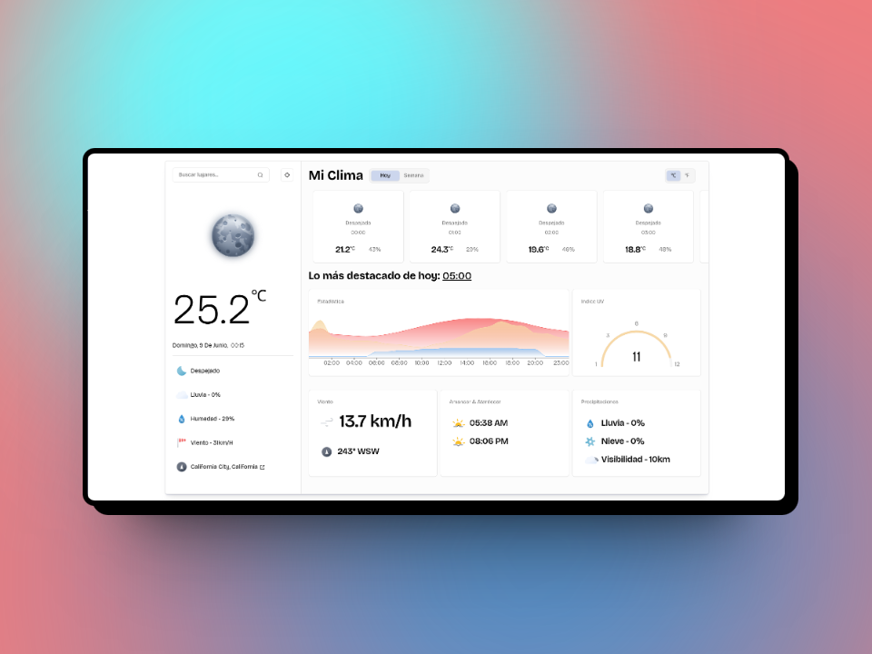

# Weather App

Aplicación de clima hecha con NextJS y Weather API. Diseñado por [Awsmd](https://dribbble.com/shots/20449736-Weather-App).

Iconos animados [meteocons](https://bas.dev/work/meteocons)

Iconos de climas [oliver pitsch](https://www.figma.com/community/file/1290644894897835248)

[DEMO]()

# Screenshots

## Inspiración


## Deploy



## Tech Stack

**App:**

- [NextJS 14](https://nextjs.org)
- [ReactJS 18](https://reactjs.dev)
- [NodeJS 20.10.0](https://nodejs.org)

**Infra:**

- [Vercel](https://vercel.com)
- [WeatherAPI](https://weatherapi.com/)

## Development

Clonar el repositorio

```bash
  git clone https://github.com/emirchus/weather-web.git
```

Instalar depedencias

```bash
  pnpm i
```

Crear variables de entorno.
Copiar y pegar archivo _template.env_ en _.env.local_

Obtener API KEY de acá → [Weather Api](https://www.weatherapi.com/)

```
NEXT_PUBLIC_API_KEY=
NEXT_PUBLIC_VERCEL_URL=
```

Ejecutar

```bash
pnpm dev
```

## Arquitectura

No seguí nada en especifico, solo mi instinto

```
weather-app/
│
├── public/
│
├── src/
│   ├── app/
│   │   ├── (api)/
│   │   │   ├── og/
│   │   │      └── route.tsx
│   │   ├── action.tsx
│   │   ├── layout.tsx
│   │   └── page.tsx
│   ├── components/
│   │   ├── ...components
│   │   └── ui/
│   ├── interface/
│   │   └── api entities
│   ├── lib/
│   │   ├── api.ts
│   │   ├── config.ts
│   │   ├── utils.ts
│   │   └── weather-score.ts
│   ├── provider/
│   │   └── theme-provider.tsx
│   └── enviroment.d.ts\
│
├── next.config.mjs
├── .env.local
├── tailwind.config.ts
└── tsconfig.json
```

## Features

- Busqueda de locacion
- Busqueda por coordenadas
- Clima actual
- Clima semanal
- Soporte OG

## Feedback

Por comentarios o pr, hablenme por :3 [@emirchus](https://twitter.com/emirchus)

## Autor

- [@emirchus](https://emirchus.dev.ar/)
